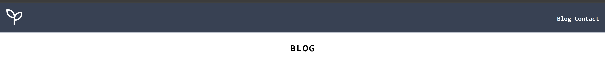

# 🌱 Plant Blog (Tailwind CSS Practice)

This project is a simple blog-style webpage built while practicing **Tailwind CSS**.  
It demonstrates how to create a responsive layout with a **header, blog cards, and a footer** using Tailwind’s utility-first classes.

---

## Features
- **Responsive header** with navigation links and a logo.
- **Blog section** displaying multiple posts as styled cards.
  - Each card includes:
    - Author profile picture and name
    - Post title & preview text
    - Like button with hover effects
    - Post image with hover opacity transition
- **Footer** with a newsletter subscription form.
- Utility classes for:
  - Responsive design (`sm:flex`, `sm:justify-between`, etc.)
  - Typography (`font-mono`, `uppercase`, `tracking-widest`, etc.)
  - Spacing & layout (`flex`, `gap-8`, `mx-auto`, `p-4`, etc.)
  - Interactive states (`hover:shadow-lg`, `hover:opacity-100`, etc.)

---

## Technologies Used
- **HTML5**
- **Tailwind CSS** (via CDN)

---

## Preview
The page layout includes:
- **Header** →   
- **Main content** →   
- **Footer** →  

---

## How to Run
1. Clone/download this repo.
2. Open `index.html` in your browser.
3. That’s it — no build setup required since Tailwind is loaded via CDN.

---

## Future Improvements
- Add more blog posts dynamically (via JavaScript or a CMS).
- Make the **Like button** interactive with click functionality.
- Expand navigation with multiple pages.
- Replace CDN with a **custom Tailwind config** for more control.

---

Built for Tailwind CSS practice.

